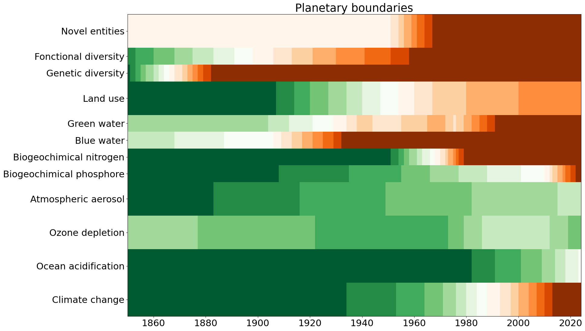

# The Planetary Flag
This repository aims to create a planetary flag, based on the planetary boundaries therorized by Johan Rockström et al in 2009, and increasingly developed afterwards. The format used is inspired by the Warming Stripes from Ed Hawkings, because of the interpretability of those, even outside of the scientist community.

A graphic version of the flag from 1850 to 2021 can be found herebelow. The white color aims to represent the current limit level considered. Howerver, as these limits are interdependent, the limit should not be considered as an hard limit.  

In details, the flag represents :

